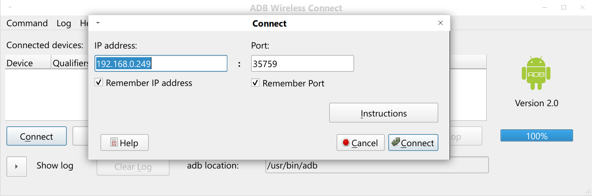
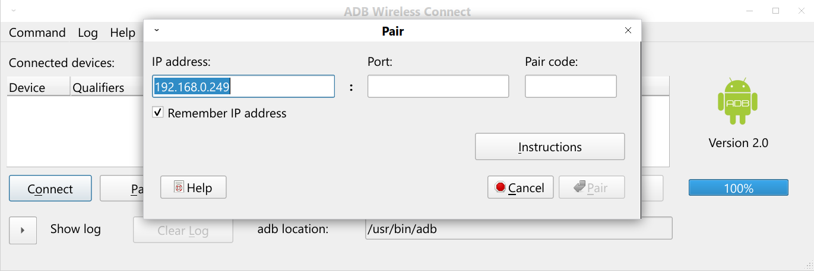

# ADB Wireless Connect

## Overview

ADB Wireless Connect is a GUI front-end to list, pair, connect or disconnect an Android device using adb. It is available in Linux, Windows and macOS. 

ADB Wireless Connect application instructions are on the <a href="https://github.com/Jalopy-Tech/ADB-Wireless-Connect/blob/main/ADB-Wireless-Connect.md">ADB Wireless Connect</a> page.

The app relies on ADB Tools being installed with the adb executable file in the search PATH. Instructions to install ADB Tools in your particular operating system will be available on the web. A simple and common method of installing ADB Tools for Linux, Windows and macOS is given below.

## Screenshots

### Main Window


### Connecting


### Pairing


## Installation

### Linux

First uninstall any previous versions using the maintenance tool (see below).

In the latest <a href="https://github.com/Jalopy-Tech/ADB-Wireless-Connect/releases">release</a>, download the executable file "ADB-Wireless-Connect-Linux-Installer.run" and run it in Linux. This installer will ask for the destination folder to be created. It defaults to a new folder ("adb-wireless-connect") in the home folder. The app can also be installed to a root folder such as "/opt/adb-wireless-connect" as desired (root password will be needed).. The app files will be installed and a shortcut will be added to the menu under "Other". The app can be run directly using the "adb-wireless-connect.sh" file in the installation folder.

To uninstall, go to the installation folder and run the executable file "adb-wireless-connect-maintenance-tool".

ADB Tools needs to be installed and in the search PATH. ADB Tools may be available in your distribution's software manager.

- Debian/Ubuntu/Mint-based Linux command:

  ```
  sudo apt-get install android-tools-adb
  ```

- Fedora/SUSE-based Linux command:

  ```
  sudo yum install android-tools
  ```

Be aware that this may not be the lasted version of ADB Tools. This is especially relevant if the version does not support the adb pair command. To install the latest version manually, see the following guide: https://www.xda-developers.com/install-adb-windows-macos-linux/ . Make sure the adb is in your PATH. This can be set in your .profile file.

###  Windows

First uninstall any previous versions using the maintenance tool (see below).

In the latest <a href="https://github.com/Jalopy-Tech/ADB-Wireless-Connect/releases">release</a>, download the executable file "ADB-Wireless-Connect-Windows-Installer.exe" and run it in Windows. This installer will ask for the destination folder to be created. It defaults to a new folder "C:\Program Files\ADB Wireless Connect". The app can also be installed to a home folder. A shortcut in the Windows start menu under "ADB Wireless Connect" and a desktop shortcut will be created.

To uninstall, go to the Control Panel, then Programs and uninstall ADB Wireless Connect. To uninstall manually, go to the installation folder and run the executable file "ADBWirelessConnectMaintenanceTool.exe".

To install ADB Tools in Windows, do the following:

1. Download the [Android SDK Platform Tools ZIP file for Windows](https://dl.google.com/android/repository/platform-tools-latest-windows.zip).
2. Extract the contents of this ZIP file into an easily accessible folder.e.g. "C:\platform-tools".
3. Press the Windows key and search for "Edit the system environment variables" and open up this Control Panel app.
4. In the "Advanced" page tab, click the "Environment variables" button.
5. In the "User variables" for your user section, highlight the "Path" variable and click the "Edit" button.
6. Click the "New" button and then click the "Browse" button to add a new folder to the path.
7. Select the folder where you put the downloaded ADB Tools folder. e.g. "C:\platform-tools".
8. Log out or restart Windows to allow the path to be reset.

### macOS

First uninstall any previous versions using the maintenance tool (see below).

In the latest <a href="https://github.com/Jalopy-Tech/ADB-Wireless-Connect/releases">release</a>, download the ADB-Wireless-Connect-macOS-Installer.dmg file and open it in macOS. The image will mount showing the "ADB-Wireless-Connect-macOS-Installer.app". Open this app to run the installer. This installer will ask for the destination folder to be created. It defaults to a new folder ("ADB Wireless Connect") in the user's "Application" folder. A shortcut in Launcher will be created. Note that the program doesn't launch from the installation (it should), but will launch normally from Launcher afterwards.

To uninstall, go to the installation folder using Finder. Run the "ADB Wireless Connect Maintenance Tool.app" app to uninstall.

ADB Tools can be installed using  Homebrew. Open the Terminal app, and enter the following command:

```bash
brew install --cask android-platform-tools
```

Be aware that this may not be the lasted version of ADB Tools. This is especially relevant if the version does not support the adb pair command. To install the latest version manually, see the following guide: https://www.xda-developers.com/install-adb-windows-macos-linux/ . The adb command should be in /usr/local/bin which will be found by ADB Wireless Connect. If it isn't in a standard path, make sure the adb folder is in your PATH using:

```bash
sudo launchctl config user path /This/is/the/path/to/the/sacad/command
```

## Compiling from Source

To compile from source, <a href="https://www.qt.io/">QT</a> Community Edition version 6.31 (or newer) needs to be installed on the relevant platform. All source code is stored in the "source" folder including the abd-wireless-connect.pro file which can be opened by the QT Creator app. Building in QT Creator or using qmake will create a executable file without dependencies added. It is recommended to set the build folder to "../builds" in order to build the executable in a folder expected by the packagers mentioned below.

An installer including dependencies can be packaged using the set up files in the folder "packagers". There is a folder with a packager script for each platform. Run the relevant packager script which will be named "ADB-Wireless-Connect-[platform]-Packager.[ext]". The packager will create an installer in the same folder. This installer is a single executable file which will install the application on the target platform with all dependencies included. The packager script may need the paths adjusting if the QT utilities are not in the expected paths.

## License

Copyright &copy; 2022 Robert J. Joynt.

The <a href="https://github.com/Jalopy-Tech/ADB-Wireless-Connect/blob/master/LICENSE.md">ADB Wireless Connect license</a> uses the <a href="https://www.qt.io/">QT</a> GPLv3 <a href="https://doc.qt.io/qt-6/gpl.html">Open Source License</a>

## Contact

For further inquires, please email: robertjjoynt@gmail.com .


